# Лабораторная работа 2
 
**Развёртывание веб-сервера в Amazon Web Services (AWS)**

### Задание 1. Подготовка аккаунта

В рамках первого задания была выполнена первоначальная настройка аккаунта AWS для дальнейшей работы с облачными ресурсами.

Работа выполнялась в регионе **Europe (Frankfurt)** (`eu-central-1`).

### 1.1 Создание группы IAM

В сервисе **IAM** была создана группа пользователей:

```text
Admins
```

Для группы была подключена политика:

```text
AdministratorAccess
```

Данная политика предоставляет пользователю административный доступ к ресурсам AWS.

### 1.2 Создание IAM-пользователя

После создания группы был создан отдельный пользователь IAM:

```text
ADMIN1
```

Для пользователя был включён доступ к AWS Management Console. Пользователь был добавлен в группу `Admins`.

После создания пользователя дальнейшая работа с AWS выполнялась через созданную IAM-учётную запись.

### 1.3 Настройка бюджета

Для контроля расходов был создан бюджет AWS с использованием шаблона:

```text
Zero spend budget
```

Имя бюджета:

```text
ZeroSpend
```

В качестве получателя уведомлений был указан адрес электронной почты пользователя.

Бюджет предназначен для получения уведомления при появлении расходов в аккаунте AWS.

**Рисунок 1 — Настроенный бюджет ZeroSpend**


### Ответ на контрольный вопрос

**Что разрешает политика AdministratorAccess?**

Политика `AdministratorAccess` предоставляет пользователю полный административный доступ к ресурсам и сервисам AWS. Пользователь с такой политикой может создавать, изменять и удалять большинство ресурсов в аккаунте.

**Почему для повседневной работы нельзя использовать root?**

Root-пользователь имеет максимальные права в AWS, поэтому его постоянное использование повышает риск случайного удаления ресурсов или изменения критических настроек. Для повседневной работы рекомендуется использовать отдельные IAM-учётные записи с необходимыми правами.

---

# Задание 2. Запуск экземпляра EC2

Во втором задании был создан виртуальный сервер Amazon EC2, на котором впоследствии будет размещён веб-сервер.

В сервисе **EC2 → Instances → Launch instances** был создан экземпляр со следующими параметрами:

| Параметр       | Значение           |
| -------------- | ------------------ |
| Имя экземпляра | `webserver`        |
| AMI            | Amazon Linux 2023  |
| Тип экземпляра | `t3.micro`         |
| Регион         | Europe (Frankfurt) |
| VPC            | Default VPC        |
| Public IP      | Включён            |
| Security Group | `webserver-sg`     |

Для подключения к серверу была создана пара ключей:

```text
sergey-keypair
```

Тип ключа:

```text
ED25519
```

Формат приватного ключа:

```text
.pem
```

### 2.1 Настройка Security Group

Для экземпляра была создана Security Group:

```text
webserver-sg
```

В неё были добавлены следующие правила входящего трафика:

| Протокол | Порт | Источник    | Назначение                        |
| -------- | ---: | ----------- | --------------------------------- |
| SSH      |   22 | My IP       | Подключение к серверу по SSH      |
| HTTP     |   80 | `0.0.0.0/0` | Доступ к веб-серверу из Интернета |

Таким образом, SSH-доступ ограничен текущим IP-адресом пользователя, а HTTP-доступ разрешён для всех внешних пользователей.

### 2.2 User Data

При создании экземпляра в разделе **Advanced details → User data** был указан следующий скрипт:

```bash
#!/bin/bash

dnf -y update
dnf -y install htop nginx
systemctl enable --now nginx
```

Скрипт автоматически устанавливает обновления системы, устанавливает программы `htop` и `nginx`, после чего запускает веб-сервер nginx и добавляет его в автозапуск.

### Ответы на контрольные вопросы

**Что такое User Data и когда выполняется этот скрипт?**

User Data — это механизм начальной автоматической настройки экземпляра EC2. Скрипт передаётся экземпляру при его создании и выполняется во время первоначального запуска.

**Выполнится ли он повторно после перезагрузки экземпляра?**

Обычный User Data-скрипт не выполняется заново при каждой обычной перезагрузке экземпляра. Поэтому установленные программы не устанавливаются повторно.

### 2.3 Запуск экземпляра

После заполнения всех параметров был выполнен запуск экземпляра.

После запуска экземпляр `webserver` перешёл в состояние:

```text
Running
```

Проверки состояния экземпляра были успешно пройдены.

**Рисунок 2 — Запущенный экземпляр EC2**

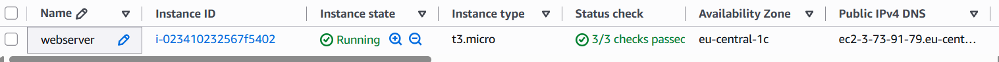

### 2.4 Проверка веб-сервера

После запуска экземпляра был определён его публичный IP-адрес.

В браузере был открыт адрес:

```text
http://3.73.91.79
```

В результате отобразилась стандартная приветственная страница nginx, что подтверждает успешную установку и запуск веб-сервера.

**Рисунок 3 — Стандартная страница nginx**

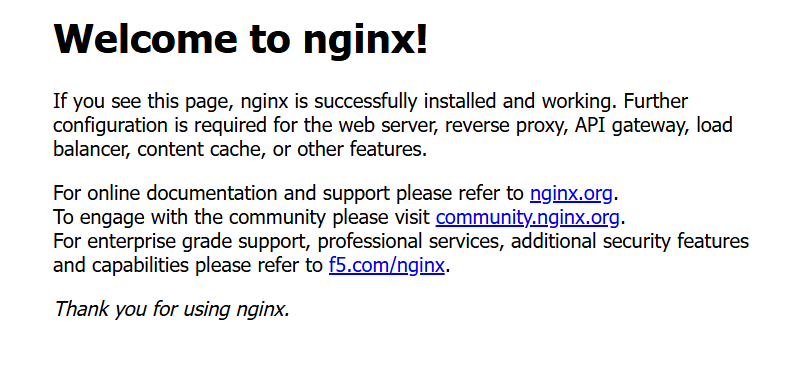

# Задание 3. Мониторинг и диагностика

Нужно изучить средства мониторинга и диагностики экземпляра Amazon EC2, проверить состояние виртуальной машины, просмотреть метрики CloudWatch, системный журнал и снимок экрана экземпляра.

## 3.1. Проверка Status Checks

В консоли AWS был открыт созданный ранее экземпляр EC2 `webserver` и вкладка **Status and alarms**.

Amazon EC2 выполняет несколько проверок состояния экземпляра:

* **System status check** — проверяет инфраструктуру AWS, физический сервер и сеть, на которых работает экземпляр.
* **Instance status check** — проверяет саму виртуальную машину, в частности загрузку операционной системы и её доступность.
* **Attached EBS status check** — проверяет доступность подключённых томов EBS.

В результате проверки экземпляра были успешно пройдены.

**Рисунок 3.1 — Status checks экземпляра EC2**

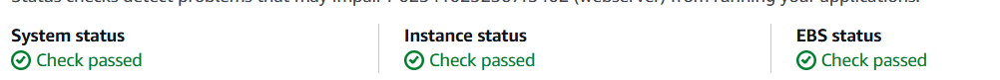

### Ответ на вопрос

Проблему, которую можно исправить самостоятельно внутри виртуальной машины, укажет **Instance status check**, поскольку эта проверка связана с состоянием самого экземпляра и операционной системы.

**System status check** указывает на проблемы с инфраструктурой AWS, поэтому неисправность в данном случае может находиться на стороне AWS.

## 3.2. Мониторинг CloudWatch

Далее была открыта вкладка **Monitoring** экземпляра EC2.

На странице отображаются метрики Amazon CloudWatch, включая:

* загрузку процессора;
* сетевой трафик;
* операции чтения и записи диска.

По умолчанию используется **Basic monitoring**, при котором метрики поступают примерно один раз в 5 минут.

Также существует **Detailed monitoring**, при котором метрики поступают примерно один раз в минуту. Детальный мониторинг является платной функцией.

**Рисунок 3.2 — Мониторинг экземпляра EC2**

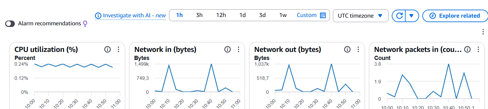

### Ответ на вопрос

Детальный мониторинг стоит включать в случаях, когда необходимо получать более частые данные о состоянии экземпляра и быстрее реагировать на изменения нагрузки. Например, он может использоваться для более точного наблюдения за производительностью сервера.

Для простого учебного сервера базового мониторинга достаточно.

## 3.3. Просмотр System Log

Для просмотра системного журнала был выбран пункт:

**Actions → Monitor and troubleshoot → Get system log**

System Log представляет собой вывод консоли экземпляра, аналогичный информации, которую можно было бы увидеть непосредственно на мониторе сервера.

В журнале были просмотрены сообщения, связанные с загрузкой операционной системы и выполнением скрипта **User Data**, в котором выполнялась установка nginx.

**Рисунок 3.3 — System Log экземпляра EC2**

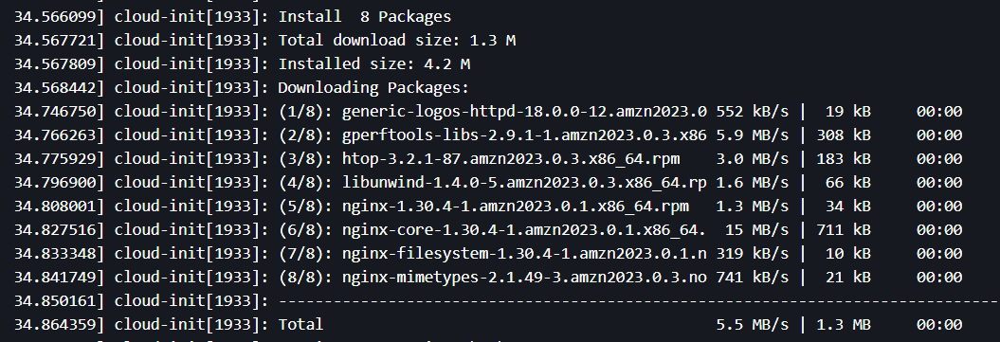

## 3.4. Получение Instance Screenshot

Для дополнительной диагностики был выбран пункт:

**Actions → Monitor and troubleshoot → Get instance screenshot**

Instance Screenshot позволяет получить снимок экрана виртуальной машины.

Данный инструмент особенно полезен в ситуации, когда невозможно подключиться к экземпляру по SSH. По полученному снимку можно определить, загрузилась ли операционная система и на каком этапе может возникать проблема.

**Рисунок 3.4 — Instance Screenshot**

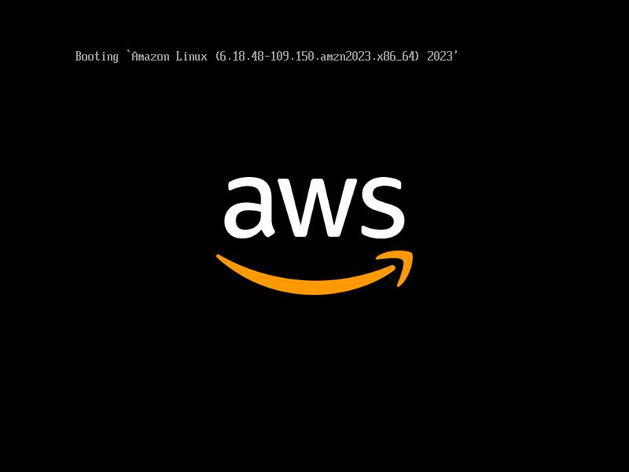

---

# Задание 4. Подключение по SSH

Нужно подключиться к экземпляру Amazon EC2 по протоколу SSH и проверить работу установленного веб-сервера nginx.

## 4.1. Подключение к экземпляру

Для подключения к серверу был использован терминал Windows PowerShell.

В Windows для указания расположения приватного ключа используется переменная `$HOME`.

Команда подключения имеет следующий вид:

```powershell
ssh -i $HOME\.ssh\yournickname-keypair.pem ec2-user@<Public-IP>
```

Параметры команды:

* `ssh` — запуск SSH-подключения;
* `-i` — указание файла приватного ключа;
* `ec2-user` — стандартное имя пользователя для Amazon Linux;
* `<Public-IP>` — публичный IP-адрес экземпляра EC2.

При первом подключении было подтверждено доверие к серверу ответом:

```text
yes
```

**Рисунок 4.1 — Подключение к EC2 по SSH**

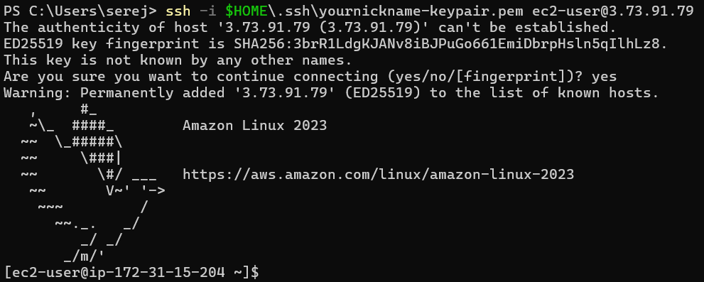

## 4.2. Проверка работы nginx

После подключения к экземпляру была выполнена команда:

```bash
systemctl status nginx
```

Команда позволяет проверить текущее состояние службы nginx.

В результате было установлено, что служба nginx запущена и работает.

Основная строка результата:

```text
Active: active (running)
```

**Рисунок 4.2 — Проверка состояния nginx**

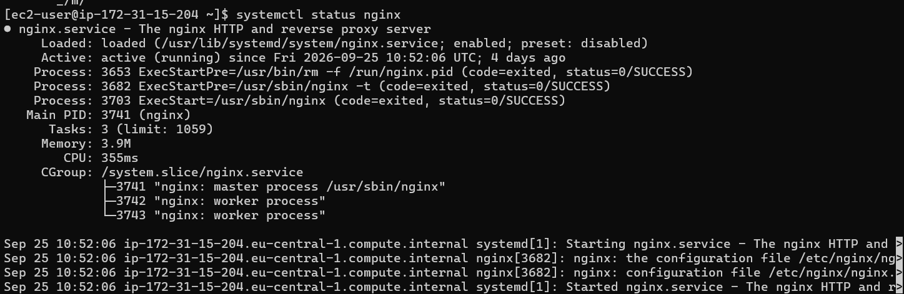

## 4.3. Почему используется ключ, а не пароль?

Для подключения к экземпляру EC2 используется пара криптографических ключей: **приватный ключ** хранится у пользователя, а соответствующий ему публичный ключ используется сервером для проверки подлинности.

При подключении пользователь подтверждает владение приватным ключом, поэтому отдельный пароль для входа на экземпляр не требуется.

Использование ключевой аутентификации позволяет безопасно идентифицировать пользователя при SSH-подключении.

# Задание 5. Статический сайт

В данном задании необходимо создать три связанные HTML-страницы, загрузить их на сервер Amazon EC2 и настроить их отображение через веб-сервер nginx.

## 5.1. Создание и передача файлов на сервер

На локальном компьютере были созданы три HTML-файла, ссылающиеся друг на друга: `index.html` (главная страница), `about.html` ("О нас") и `contact.html` ("Контакты").

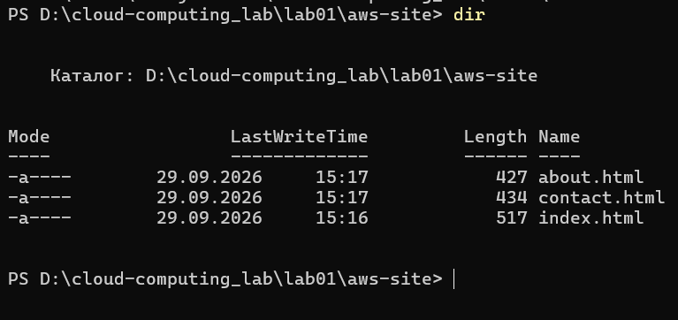

Для передачи файлов на сервер использовалась команда локального терминала PowerShell:

```powershell
scp -i $HOME\.ssh\yournickname-keypair.pem index.html about.html contact.html ec2-user@3.73.91.79:~
```

Утилита **`scp`** (Secure Copy Protocol) предназначена для безопасного копирования файлов между компьютерами в сети. Она тесно связана с `ssh` и работает поверх него. Сходство заключается в том, что `scp` использует тот же протокол, тот же порт (по умолчанию 22) и те же механизмы аутентификации (в данном случае — файл приватного ключа `.pem`), обеспечивая полное шифрование передаваемых данных.

В результате выполнения команды файлы были успешно загружены в домашнюю директорию пользователя `ec2-user`.

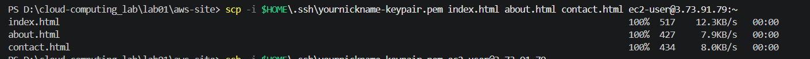

## 5.2. Размещение файлов в директории веб-сервера

После загрузки файлов было выполнено подключение к серверу по SSH:

```powershell
ssh -i $HOME\.ssh\yournickname-keypair.pem ec2-user@3.73.91.79
```

Затем файлы были перемещены в системную папку, из которой nginx раздает статический контент, командой:

```bash
sudo cp ~/*.html /usr/share/nginx/html/
```

Проверка успешного копирования выполнена командой:

```bash
ls -l /usr/share/nginx/html
```

Напрямую скопировать файлы локальной командой `scp` в директорию `/usr/share/nginx/html/` невозможно, так как эта папка принадлежит суперпользователю (`root`). Подключение по SSH и SCP осуществляется от имени пользователя `ec2-user`, который имеет права на запись только в свою домашнюю директорию (`~`). Использование утилиты `sudo` на сервере позволило выполнить команду копирования (`cp`) с правами суперпользователя.


## 5.3. Проверка работы сайта

Для проверки доступности сайта в адресной строке веб-браузера был введен публичный IP-адрес сервера:

```text
http://3.73.91.79
```

Главная страница `index.html` загрузилась корректно (заменив стандартную заглушку nginx). Навигационные ссылки между страницами "О нас" и "Контакты" работают без ошибок, что подтверждает правильную настройку веб-сервера.

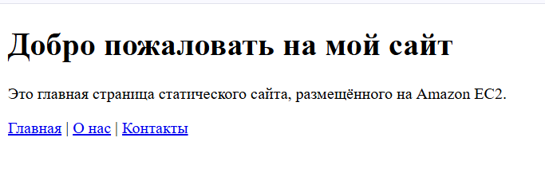

# Задание 6. Остановка экземпляра через AWS CLI

В данном задании необходимо завершить работу созданного виртуального сервера, используя интерфейс командной строки AWS CLI, и проанализировать отличия в состояниях остановки и удаления экземпляра.

## 6.1. Выполнение команды остановки

Для остановки экземпляра была использована встроенная среда AWS CloudShell (также допускается использование локального терминала PowerShell с настроенными IAM-ключами).

Параметры команды:

* `stop-instances` — действие, указывающее на необходимость остановки;
* `--instance-ids` — уникальный идентификатор виртуальной машины;
* `--region` — регион, в котором находится экземпляр (в данном случае Франкфурт).

В результате выполнения команды консоль вывела JSON-ответ, подтверждающий изменение состояния с `running` на `stopping`.

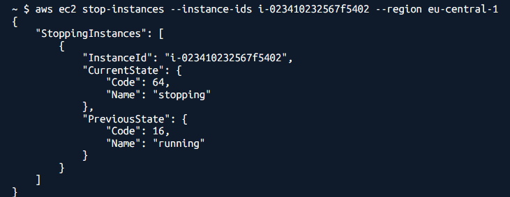

## 6.2. Отличие Stop от Terminate

В AWS EC2 предусмотрено два разных механизма прекращения работы экземпляра:

* **Stop (Остановка):** Аналогична выключению обычного компьютера. Операционная система завершает работу, а вычислительные ресурсы освобождаются. При этом сам экземпляр, его настройки и подключенный системный диск сохраняются. Экземпляр можно в любой момент запустить заново (состояние `Start`), однако его публичный динамический IP-адрес изменится.
* **Terminate (Уничтожение):** Полное и безвозвратное удаление виртуальной машины из AWS. Вместе с экземпляром по умолчанию навсегда удаляется и его корневой диск (EBS). Повторно запустить такой экземпляр невозможно.

## 6.3. Оплата остановленного экземпляра

Пока экземпляр находится в состоянии `Stopped`, плата за само время работы сервера (вычислительные мощности процессора и оперативную память) **не взимается**.

Однако оплата продолжает начисляться за следующие зарезервированные ресурсы:

1. **Amazon EBS (хранилище):** Подключенный виртуальный жесткий диск продолжает хранить данные операционной системы и сайта, занимая место на физических серверах Amazon. Оплата идет за выделенный объем (в ГБ).
2. **Elastic IP (если применимо):** Если к экземпляру был привязан выделенный статический IP-адрес, AWS будет взимать небольшую плату за его простой, пока сервер выключен.

# Задание 7. Организация и репозиторий на GitHub

**Почему папка `vendor/` и файл `.env` не попали в репозиторий? (ответ найден в `.gitignore`)**
Эти пути прописаны в файле `.gitignore`, который запрещает системе Git их отслеживать. Папка `vendor/` содержит сторонние библиотеки, которые автоматически скачиваются менеджером Composer прямо на сервере, поэтому хранить их в репозитории бессмысленно. Файл `.env` содержит конфиденциальные настройки окружения и пароли от баз данных — его публикация в открытом репозитории привела бы к критической уязвимости.


# Задание 8. Подготовка сервера

В данном задании необходимо подготовить запущенный экземпляр EC2 к развертыванию приложения, установив требуемые системные пакеты, базу данных и среду выполнения.

## 8.1. Установка программного обеспечения

После запуска экземпляра `webserver` и подключения к нему по новому публичному IP-адресу через SSH, была выполнена комплексная установка необходимых компонентов стека:

```bash
sudo dnf -y install git composer postgresql16-server php8.4-fpm php8.4-cli php8.4-pgsql php8.4-mbstring php8.4-xml

```

Установленные пакеты выполняют следующие функции:

* `git` — система контроля версий для загрузки исходного кода приложения из репозитория GitHub.
* `composer` — пакетный менеджер, необходимый для установки сторонних PHP-библиотек.
* `postgresql16-server` — сервер реляционной базы данных для хранения информации пользователей и капсул.
* `php8.4-fpm` — менеджер процессов FastCGI, который принимает запросы от nginx и выполняет PHP-код.
* `php8.4-cli` и модули (`pgsql`, `mbstring`, `xml`) — инструменты командной строки и расширения языка для корректной работы бизнес-логики и связи с БД.

Для подтверждения успешной установки была проверена доступность драйвера PostgreSQL для PHP с помощью команды `php -m | grep pdo_pgsql`. Установленный ранее веб-сервер `nginx` продолжил свою работу в штатном режиме.

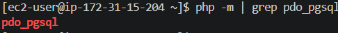

## 8.2. Особенности использования User data

**Почему пакеты устанавливаются вручную, а не через User data?**

Механизм `User data` (cloud-init) предназначен для первичной инициализации сервера и выполняется платформой AWS строго один раз — в момент начального создания виртуальной машины.

Поскольку в этой части лабораторной работы используется уже существующий экземпляр EC2, созданный в Части 1, его обычная остановка и последующий запуск (переход из состояния `Stopped` в `Running`) не приводят к повторному выполнению скрипта `User data`. Изменение этого скрипта после создания инстанса не даст результата без полной пересоздания сервера. По этой причине обновление конфигурации и доустановка пакетов на живой сервер выполняется вручную через SSH-подключение.

# Задание 9. База данных PostgreSQL

В данном задании была выполнена инициализация кластера базы данных PostgreSQL, настроена политика аутентификации и создана база данных для работы веб-приложения.

## 9.1. Инициализация и настройка аутентификации

На первом этапе были созданы системные файлы базы данных с помощью команды инициализации:

```bash
sudo postgresql-setup --initdb
```

По умолчанию PostgreSQL использует метод аутентификации `ident` для локальных сетевых подключений. Этот метод пропускает пользователя только в том случае, если его имя в операционной системе Linux строго совпадает с именем пользователя в базе данных. Поскольку веб-приложение подключается к локальной базе (`localhost`), используя логин и пароль, метод аутентификации в конфигурационном файле `pg_hba.conf` был заменен на `scram-sha-256` (надежное хеширование паролей):

```bash
sudo sed -i 's/ident$/scram-sha-256/' /var/lib/pgsql/data/pg_hba.conf
```

После изменения конфигурации служба PostgreSQL была запущена и добавлена в автозагрузку операционной системы:

```bash
sudo systemctl enable --now postgresql
```

## 9.2. Создание базы данных и пользователя

Согласно лучшим практикам безопасности, для каждого приложения рекомендуется создавать отдельную учетную запись и ограничивать ее права рамками одной базы. Были созданы пользователь `timecapsule` с паролем и одноименная база данных:

```bash
sudo -u postgres psql -c "CREATE USER timecapsule WITH PASSWORD 'скрыто';"
sudo -u postgres psql -c "CREATE DATABASE timecapsule OWNER timecapsule;"

```

## 9.3. Проверка подключения

Для проверки корректности настроек и работы парольной аутентификации был выполнен тестовый запрос к базе данных от имени созданного пользователя:

```bash
psql -h localhost -U timecapsule -d timecapsule -c "SELECT 1;"
```

После ввода пароля СУБД успешно обработала запрос и вернула таблицу с числом 1, что подтверждает полную готовность базы данных к интеграции с приложением.

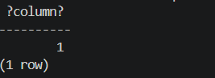

# Задание 10. Развёртывание кода приложения на сервере

В данном задании выполнено копирование исходного кода приложения из созданного GitHub-репозитория на сервер, настроены переменные окружения и инициализированы структура базы данных и зависимости.

## 10.1. Загрузка кода и базовая настройка

Для размещения приложения была создана директория `/var/www/timecapsule`, права на которую были переданы пользователю `ec2-user`. Код был загружен из публичного репозитория с помощью стандартного HTTPS-клонирования:

```bash
git clone https://github.com/serezha-cloud/timecapsule.git /var/www/timecapsule

```

*(В команде использовалась ссылка на созданную в Задании 7 организацию)*.

Поскольку в репозитории отсутствует файл с секретами (в соответствии с `.gitignore`), он был создан вручную с помощью редактора `nano` по пути `/var/www/timecapsule/.env`. В файл были внесены актуальные параметры рабочего окружения: публичный IP-адрес сервера (`APP_URL`), отключен режим отладки (`APP_DEBUG=false`), а также указаны логин и созданный ранее пароль от локальной базы данных PostgreSQL.

## 10.2. Права доступа и установка зависимостей

В Amazon Linux служба PHP-FPM выполняется от имени пользователя `apache`. Чтобы приложение могло корректно функционировать, были заданы специфические права доступа:

```bash
chmod 640 .env
sudo chgrp apache .env
sudo chown -R apache:apache storage

```

Это позволило процессу PHP читать конфигурационный файл `.env` (но закрыло его от посторонних) и дало права на запись в директорию `storage/`, куда сохраняются пользовательские файлы и сессии.

Затем были установлены PHP-зависимости проекта без библиотек для разработки (`composer install --no-dev --optimize-autoloader`) и запущен скрипт создания структуры таблиц в базе данных.

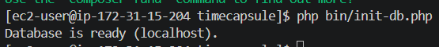

## 10.3. Ответы на контрольные вопросы

**Почему пароль к базе данных хранится в файле .env на сервере, а не в коде в репозитории?**
Хранение паролей и других секретов в системе контроля версий является критическим нарушением безопасности. Если код публичный, злоумышленники или автоматические боты мгновенно получат доступ к базе данных, а в случае приватного репозитория секреты останутся скомпрометированными в истории коммитов. Использование локального файла `.env`, который игнорируется Git, гарантирует, что конфиденциальные данные существуют только внутри защищенного сервера.

**Почему публичный репозиторий безопасен для этого приложения?**
Публичный репозиторий безопасен, так как в нем хранится исключительно логика работы (исходный код), из которого исключены все конфигурационные секреты, ключи и пользовательские данные. Кроме того, использование публичного репозитория позволяет серверу скачивать код по протоколу HTTPS в режиме "только чтение" без необходимости хранить SSH-ключи (deploy keys) или токены доступа. Даже в случае компрометации самого сервера злоумышленник не сможет отправить вредоносные изменения обратно в репозиторий на GitHub.

# Задание 11. Настройка PHP-FPM и nginx

В данном задании была выполнена настройка лимитов загрузки файлов в PHP и конфигурация веб-сервера nginx для корректной обработки запросов приложения TimeCapsule и взаимодействия с базой данных.

## 11.1. Настройка ограничений PHP и конфигурация nginx

По умолчанию PHP ограничивает размер загружаемых файлов до 2 МБ. Поскольку функционал приложения подразумевает загрузку вложений до 5 МБ, лимит `upload_max_filesize` в конфигурационном файле `/etc/php.ini` был увеличен до 6 МБ с помощью потокового редактора `sed`.

Далее был создан конфигурационный файл сайта `/etc/nginx/conf.d/timecapsule.conf`. Архитектура конфигурации построена на следующих принципах:

* **Изоляция и безопасность (`root /var/www/timecapsule/public;`):** Из интернета доступна только папка `public`. Исходный код (`src`), библиотеки (`vendor`) и конфигурация с секретами (`.env`) физически скрыты от внешних запросов. Дополнительно заблокирован доступ ко всем скрытым файлам (начинающимся с точки).
* **Единая точка входа (Front Controller):** Директива `try_files` настроена так, что если статический файл не найден, запрос передается в `index.php`, который берет на себя всю дальнейшую маршрутизацию внутри приложения.
* **Связь с PHP-FPM:** Все запросы к файлам `.php` перенаправляются процессу `php-fpm` через внутренний unix-сокет (`/run/php-fpm/www.sock`).

## 11.2. Проверка и запуск сервисов

Перед применением новых настроек была выполнена проверка синтаксиса конфигурации nginx на отсутствие ошибок.

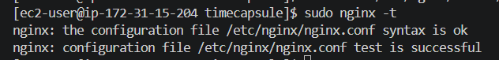

После успешной проверки службы `php-fpm` и `nginx` были добавлены в автозагрузку и перезапущены.

При переходе по публичному IP-адресу сервера в браузере успешно открылась стартовая страница (форма входа) приложения TimeCapsule.

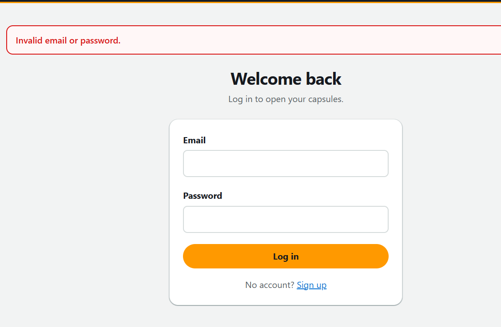

Для проверки внутреннего состояния системы и успешности подключения приложения к базе данных был запрошен системный адрес `/health`.

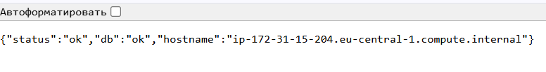

# Задание 12. Обновление приложения (Вариант B)

В данном задании был автоматизирован процесс выпуска новых версий приложения (деплоя) с помощью bash-скрипта, чтобы исключить человеческий фактор при последовательном выполнении команд обновления.

## 12.1. Создание скрипта автоматического деплоя

На сервере в домашней директории пользователя был создан скрипт `~/deploy.sh`. Скрипт содержит последовательность команд для безопасного обновления приложения:

1. Получение нового кода (`git pull --ff-only`).
2. Установка обновленных библиотек (`composer install`).
3. Применение изменений в базе данных (`php bin/init-db.php`).
4. Перезапуск менеджера процессов (`sudo systemctl reload php-fpm`).

Скрипт настроен на немедленную остановку при любой ошибке (`set -euo pipefail`), что защищает сервер от выполнения последующих шагов, если предыдущий завершился неудачно.

После выдачи скрипту прав на исполнение (`chmod +x ~/deploy.sh`), он был успешно протестирован.

## 12.2. Удаленный запуск деплоя

Для имитации работы систем CI/CD скрипт был запущен прямо с локального компьютера (без интерактивного входа на сервер) с помощью передачи команды через SSH:

```powershell
ssh -i $HOME\.ssh\yournickname-keypair.pem ec2-user@3.73.91.79 ./deploy.sh
```

Утилита SSH подключилась к серверу, выполнила скрипт обновления, вывела логи процесса в локальный терминал и автоматически отключилась.

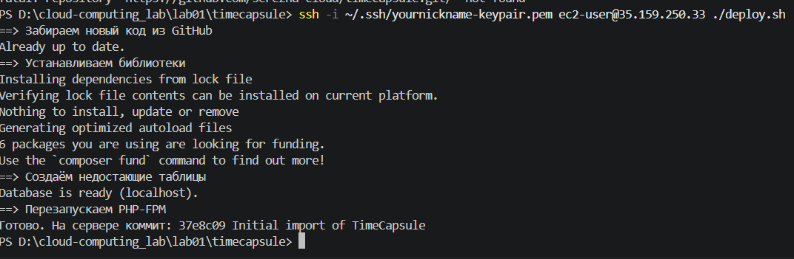

## 12.3. Ответы на контрольные вопросы

**Что может увидеть посетитель, который откроет сайт в момент выполнения git pull?**
Поскольку `git pull` заменяет файлы последовательно, а не мгновенно, посетитель может попасть на промежуточное состояние приложения, когда часть файлов уже новая, а часть — старая. Это с высокой вероятностью приведет к «поехавшей» верстке или критическим ошибкам PHP (например, вызов еще не обновленного класса), из-за чего пользователь увидит ошибку 500 (Internal Server Error) или белый экран.

**Что случится с сайтом, если после git pull не выполнится composer install?**
Если `composer install` завершится ошибкой, на сервере останется новый исходный код приложения, но при этом будут отсутствовать новые или обновленные сторонние библиотеки, которые этому коду требуются. Приложение не сможет найти нужные классы зависимостей, что гарантированно приведет к фатальной ошибке и полной неработоспособности сайта до тех пор, пока библиотеки не будут установлены или код не будет откачен назад.

# Задание 13. Выпуск новой версии, поломка и откат

В данном задании на практике проверен полный цикл обновления веб-приложения: от успешного развертывания нового функционала до симуляции критической ошибки и экстренного отката (rollback) через систему контроля версий.

## 13.1. Успешный выпуск новой версии

Для проверки работоспособности системы локально в файл `views/layout.php` (подвал сайта) была добавлена строка с именем автора. Изменения были зафиксированы (`git commit`) и отправлены на GitHub (`git push`). Затем с локального компьютера был запущен удаленный скрипт деплоя. Обновление прошло успешно: на сайте появилось внесенное изменение, а ранее созданная тестовая капсула с вложением сохранилась, так как папка `storage` не затрагивается деплоем.

*(Приложение с добавленным именем автора в подвале)*

## 13.2. Симуляция поломки и проверка /health

Затем в конец файла `views/layout.php` была намеренно добавлена синтаксическая ошибка PHP (`<?php broken(`). После повторного деплоя главная страница сайта ожидаемо перестала работать, выдавая ошибку 500 (Internal Server Error).

**Ответы на вопросы по эндпоинту /health:**

* **Почему /health отвечает ok, хотя страница не работает? Что он проверяет?**
Маршрут `/health` обрабатывается отдельным легковесным контроллером, который проверяет только базовые вещи: запускается ли PHP в принципе и есть ли успешное подключение к базе данных. Он не использует общий шаблон сайта (`layout.php`), поэтому синтаксическая ошибка в визуальной части его не затрагивает.
* **Чего не хватает такой проверке?**
Такой "наивной" проверке не хватает реального рендеринга ключевых страниц приложения или запуска автоматических интеграционных тестов. Она не гарантирует, что бизнес-логика или пользовательский интерфейс действительно работают и не содержат фатальных ошибок.

## 13.3. Откат версии (Rollback)

Вносить исправления напрямую на сервере нельзя, так как это приведет к конфликтам (merge conflicts) при следующих обновлениях `git pull`. Откат был выполнен локально с помощью создания реверт-коммита, отменяющего последние изменения:

```powershell
git revert --no-edit HEAD
git push
```

После повторного запуска скрипта `deploy.sh` работоспособность сайта была полностью восстановлена.

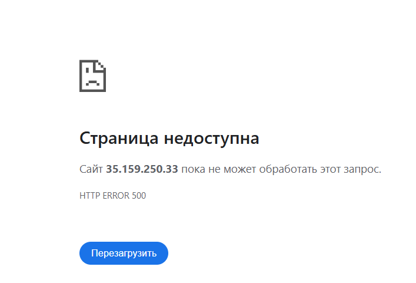


**Ответы на вопросы по времени простоя (downtime):**

* **Сколько времени сайт был сломан и из чего оно сложилось?**
Сайт был недоступен несколько минут. Это время сложилось из: 1) обнаружения ошибки разработчиком; 2) локального выполнения команды `git revert` и отправки кода в репозиторий; 3) повторного запуска скрипта деплоя; 4) времени отработки `composer install` и перезапуска `php-fpm`.
* **Как можно было бы сократить это время?**
Время простоя можно было бы свести к нулю двумя способами: внедрением CI/CD пайплайнов (например, линтеров), которые автоматически проверяли бы синтаксис перед деплоем и просто не пропустили бы сломанный код на сервер; либо использованием стратегии Blue/Green развертывания, где код сначала разворачивается на резервном окружении, тестируется, и только при успехе на него переключается реальный трафик.

# Контрольные вопросы

**Как проходит запрос от браузера до базы данных в вашем развёртывании? Какую роль играет каждая программа?**
Запрос от браузера по HTTP (порт 80) принимает веб-сервер **nginx**, который самостоятельно и быстро отдает статические файлы (CSS, JS, изображения). Если запрос требует динамической генерации (например, сохранение капсулы), nginx передает его процессу **PHP-FPM** через внутренний unix-сокет. PHP-FPM выполняет PHP-скрипты с бизнес-логикой и обращается к реляционной базе данных **PostgreSQL** по локальному порту 5432 для записи или чтения данных. Сгенерированный HTML-ответ проходит этот путь в обратном порядке и возвращается пользователю.

**Почему сервер может скачивать код из репозитория, но не может отправлять в него изменения? Почему для сервера это правильно?**
Сервер клонирует код по публичной ссылке HTTPS, которая открыта для чтения всем желающим без авторизации. Однако для отправки изменений (push) GitHub требует явной аутентификации (логин, токен или SSH-ключ), которых на сервере намеренно нет. Это фундаментальное правило безопасности: если сервер будет скомпрометирован злоумышленником, он не сможет внедрить вредоносный код в главный репозиторий проекта.

**Что произойдёт с загруженными пользователями файлами, если удалить экземпляр EC2? Как это связано с тем, что вы знаете об EBS?**
При удалении (Terminate) виртуальной машины EC2 все пользовательские файлы будут безвозвратно потеряны. Это связано с настройками облачного хранилища **EBS (Elastic Block Store)**: по умолчанию корневой диск EBS жестко привязан к жизненному циклу экземпляра и автоматически уничтожается вместе с ним при вызове команды Terminate.

**Что общего у вашего deploy.sh или последовательности команд варианта A с тем, что делают системы CI/CD? Чего в вашем процессе ещё не хватает?**
Скрипт `deploy.sh` разделяет главную идею CD (Continuous Deployment): он превращает рутинный процесс обновления (загрузка кода, установка зависимостей, обновление БД) в стандартизированный, автоматический и предсказуемый алгоритм. Однако текущему процессу не хватает этапа непрерывной интеграции (CI) — автоматического запуска тестов и проверок синтаксиса перед деплоем. Также отсутствует автоматический триггер: сейчас деплой запускается вручную с компьютера разработчика, тогда как полноценная CI/CD-система разворачивает код автоматически при событии `git push` в главную ветку.